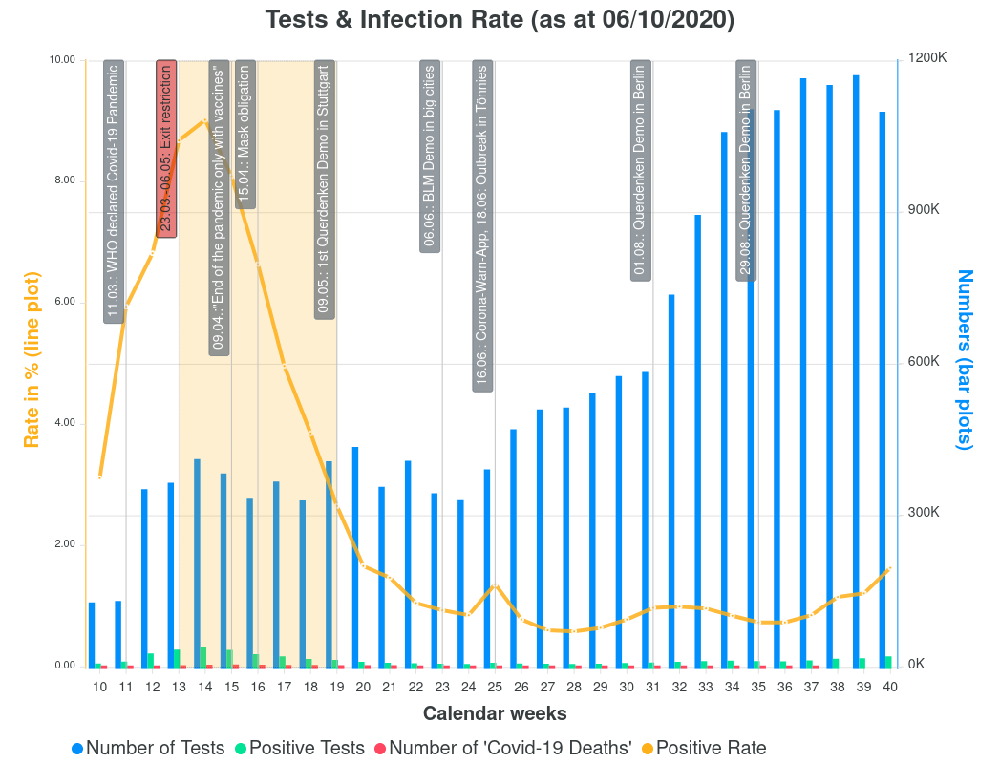

# Visualization of the Covid Pandemic Data in Germany

Since many visualization lack of the test data, I would like to give another perspective of the Covid data visualization.
Most of the dataset do not contains the number of conducted tests. Since no test has 100% specificity and sensitivity, it is crucial to visualize the absolute numbers with the other variables.

Visualizing the absolute numbers alone without any relations can lead to a misinterpretation and wrong perceptions.



## Todo

* Adding another countries
* Adding relation graphs covid deaths vs influenza death globally

## Other sources

* Michael Levitt: https://youtu.be/8aHrx68IT7o, https://www.youtube.com/watch?v=hrTFXwLXUC8
* Ivor Cummins: https://youtu.be/8UvFhIFzaac

## Quasar Development

### Install the dependencies
```bash
npm install
```

### Start the app in development mode
```bash
quasar dev
```
### Lint the files
```bash
npm run lint
```

### Build the app for production
```bash
quasar build
```
## Donation

If you appreciate my work, you can help contribute to the code or doing a one time donation on Paypal.

[](https://www.paypal.com/cgi-bin/webscr?cmd=_s-xclick&hosted_button_id=9H9M4LHP8L8EQ&source=url)
